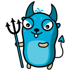
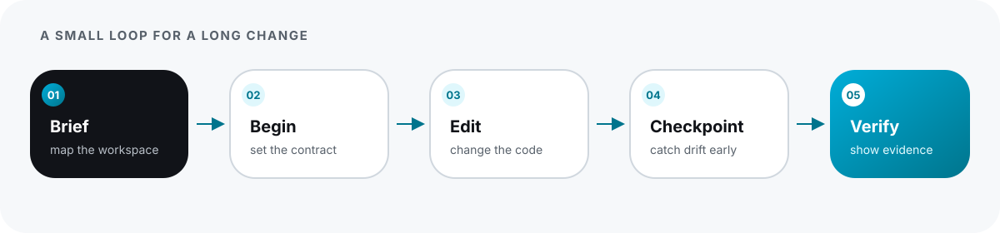
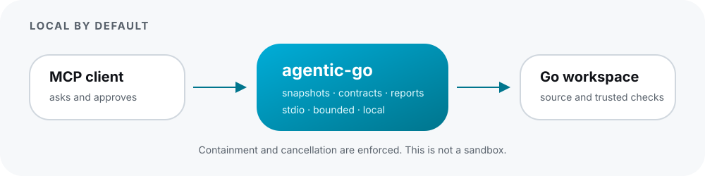

<p align="center">
  
</p>

<h1 align="center">agentic-go</h1>

<p align="center">Source-grounded Go intelligence for coding agents.</p>

<p align="center">
  <a href="#install"></a>
  <a href="#connect"></a>
  <a href="https://agentic-mcps.github.io/go/docs/"></a>
  <a href="https://github.com/agentic-mcps/go/releases/tag/v1.0.0"></a>
</p>

<p align="center"><a href="https://agentic-mcps.github.io/go/">Website</a> · <a href="https://agentic-mcps.github.io/go/docs/">Docs</a> · <a href="#install">Install</a> · <a href="#connect">Connect</a> · <a href="#workflow">Workflow</a> · <a href="#capabilities">Capabilities</a> · <a href="#faq">FAQ</a></p>

`agentic-go` is a local Go MCP server and CLI. It gives an external coding agent semantic context, change continuity, guarded refactoring, and executed verification without embedding an LLM or becoming an agent framework.

## Install

On macOS or Linux:

```sh
brew install agentic-mcps/tap/agentic-go
agentic-go --version
```

That installs `agentic-go`, the pinned `agentic-go-gopls` companion, and `agentic-go-vet`. The formula tracks the signed `v1.0.0` release archives for Darwin/Linux amd64 and arm64.

<details>
<summary>Install from the release archive instead</summary>

```sh
curl -fsSL https://raw.githubusercontent.com/agentic-mcps/go/v1.0.0/scripts/install.sh \
  | bash -s -- 1.0.0
```

The installer places the binaries in `~/.local/bin` and verifies the release checksum before replacing them.
</details>

## Connect

Start `agentic-go` as a stdio MCP server with your Go workspace as its working directory. The process is local; there is no daemon, port, or hosted account to configure.

<details>
<summary>Generic MCP entry</summary>

```json
{
  "mcpServers": {
    "agentic-go": {
      "command": "agentic-go",
      "args": ["--workspace", "/absolute/path/to/your/go/module"]
    }
  }
}
```

`--workspace` defaults to the current directory. The client controls approvals for operations that execute repository code.
</details>

## Workflow

The useful loop is deliberately small: orient, set intent, edit, catch drift, then verify.

<p align="center">
  
</p>

For a direct change report:

```sh
agentic-go verify --base origin/main --package ./... --format text
```

The report is conservative, package-aware, and explicit about evidence and uncertainty. It never selects individual tests. JSON output follows `agentic.verify/v1`; exit `0` means pass, `1` means policy findings, and `2` means incomplete or execution failure.

## Capabilities

| Area | What the agent gets |
| --- | --- |
| Workspace context | Package APIs, diagnostics, definitions, references, implementations, related tests, and bounded call relationships. |
| Change continuity | A private contract containing the goal, scope, decisions, questions, drift, and snapshot lineage. |
| Guarded refactoring | Preview or apply deterministic rename, formatting, import organization, and approved `source.fixAll` edits. |
| Verification | Impact, whole-package tests, coverage, optional race evidence, calibrated findings, contract compliance, and uncertainty. |

Every result is tied to an immutable snapshot. Stale references fail instead of silently moving the goalposts.

<p align="center">
  
</p>

## FAQ

<details>
<summary>Does this replace gopls?</summary>

No. A pinned gopls sidecar provides semantic capabilities; agentic-go adds snapshots, continuity, guarded mutation, and verification around it.
</details>

<details>
<summary>Can it change my files?</summary>

Only an explicitly approved, snapshot-bound deterministic refactor can mutate existing contained non-generated files. Git state never changes.
</details>

<details>
<summary>What does it run?</summary>

Execution tools may compile and run trusted repository tests, benchmarks, or fuzz functions with the server process's privileges. Audit tools are read-only. Containment is not a sandbox.
</details>

<details>
<summary>What is supported?</summary>

Go 1.25, 1.26, and 1.27 on Darwin and Linux for amd64 and arm64. The release bundles gopls v0.21.0. Newer stable Go versions may pass preflight but are not claimed. The organization module and the former personal module are separate identities with no alias or automatic mirroring.
</details>

<details>
<summary>Maintainer notes: Action and evidence</summary>

The optional composite [GitHub Action](action.yml) downloads the exact release, verifies its checksum, and writes a job summary plus JSON report. It is advisory by default and requests no pull-request write permission.

The [v0.2 evidence](validation/v0.2.0/summary.md) records contract goldens, CLI dogfood, release checks, and reviewed historical changes. The [v0.1 calibration](validation/v0.1.0/summary.md) covered 10 pinned repositories and 467 reviewed findings with 0% observed false positives in that corpus. This is corpus-specific evidence, not a universal guarantee. No paid model pilot has run.
</details>

## More

[Website](https://agentic-mcps.github.io/go/) · [Docs](https://agentic-mcps.github.io/go/docs/) · [Contracts](docs/contracts.md) · [Migration](docs/module-migration.md) · [Roadmap](docs/v1.0.0-roadmap.md) · [Contributing](CONTRIBUTING.md) · [Security](SECURITY.md) · [Issues](https://github.com/agentic-mcps/go/issues)

<details>
<summary>Artwork and license</summary>

The project mark is a supplied adaptation from [Maria Letta's Free Gophers Pack](https://github.com/MariaLetta/free-gophers-pack), released under CC0. The adaptation is controlled by Ashwin Gopalsamy; the project mark and derived graphics are licensed CC BY 4.0. It is not the official Go logo. Software is available under the [Apache-2.0 license](LICENSE).
</details>
