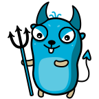

<p align="center">
  
</p>

<h1 align="center">agentic-go</h1>

<p align="center">A done-gate for agent-written Go.</p>

<p align="center">
  <a href="#install"></a>
  <a href="https://agentic-mcps.github.io/go/docs/"></a>
</p>

<p align="center"><a href="https://agentic-mcps.github.io/go/">Website</a> · <a href="https://agentic-mcps.github.io/go/docs/">Docs</a> · <a href="#install">Install</a> · <a href="#what-it-checks">What it checks</a> · <a href="#what-it-does-not-catch">Limits</a> · <a href="#evidence">Evidence</a></p>

`agentic-go check` runs when a coding agent tries to stop, before a push, or in
CI. It compares your working tree with a base and reports only the problems that
change introduced: a failing test, a deleted or skipped test, a stub left behind,
a concurrency or error-handling mistake, changed lines no test runs. The report
is short (at most 2 KB) and lists blocking items first, each with a location, a
message, and a fix. In an agent hook it blocks the stop once so the agent can fix
the problems; otherwise it reports them to you.

## Install

No released binary contains `check` yet. Install from source with Go 1.25 or
later, using a branch name or commit as the version:

```sh
go install github.com/agentic-mcps/go/cmd/agentic-go@<branch-or-commit>
agentic-go check --help
```

Or build from a clone:

```sh
go build -o agentic-go ./cmd/agentic-go
```

Run it from inside a Go module:

```sh
agentic-go check
```

The base is detected in this order: the `--base` flag, the HEAD recorded at
session start, `GITHUB_BASE_REF`, `origin/HEAD`, `origin/main`, `origin/master`,
`main`, `master`, then `HEAD`. The comparison covers committed, staged,
unstaged, and untracked changes.

| Profile | Default when | Unknown verdict |
| --- | --- | --- |
| `local` | no other profile applies | exits 0 with a note |
| `hook` | used by `--hook` | the hook allows the stop with a note |
| `ci` | `CI=true` | exits 2 |

Exit codes: `0` pass, `1` block, `2` unknown in the `ci` profile. Use
`--format json` for machine-readable output (schema id `agentic.check/v1`).

## Use with Claude Code

```sh
agentic-go init --claude            # print the hook configuration
agentic-go init --claude --write    # merge it into the settings file
```

`--scope project|local|user` chooses the settings file (default `project`). The
configuration adds a `SessionStart` hook that records the base and a `Stop` hook
that runs `agentic-go check --hook claude`.

## Use with Codex

```sh
agentic-go init --codex
agentic-go init --codex --write
```

Codex asks you to review and trust new hooks: run `/hooks` in Codex.

### How hook mode behaves

- The process always exits 0. A gate failure never blocks an agent.
- It blocks the agent's stop once per distinct change. A repeated stop with an
  identical change is let through, and unresolved items are reported to you.
- It blocks at most 3 times per session.
- It caches verdicts by a content fingerprint. In one smoke test a repeat check
  of an unchanged tree took 48 ms and a full check of a small package took about
  3 s. These are single observations, not benchmarks.
- The hook budget is 120 s. If the check cannot finish, the verdict is
  `unknown` and the stop is allowed with a note.

## Pre-push and CI

```sh
agentic-go init --git-pre-push           # print a pre-push hook
agentic-go init --git-pre-push --write   # install it
```

A GitHub Actions job that builds from source. `fetch-depth: 0` is required so
the base commit is present:

```yaml
jobs:
  agentic-go:
    runs-on: ubuntu-latest
    steps:
      - uses: actions/checkout@v4
        with:
          fetch-depth: 0
      - uses: actions/setup-go@v5
        with:
          go-version-file: go.mod
      - run: go install github.com/agentic-mcps/go/cmd/agentic-go@<branch-or-commit>
      - run: agentic-go check --profile ci --base origin/${{ github.base_ref }}
```

Replace `<branch-or-commit>` with a ref that contains `check`.

## What it checks

Checks run in this order.

| Check | What it reports |
| --- | --- |
| Syntax | Go syntax errors in changed files. |
| Test integrity | Deleted tests; tests hidden from `go test` by a rename, a build constraint, or an ignored directory; skips added to existing tests; assertions removed or turned into log calls; stub panics such as `panic("not implemented")`. |
| Golden files | Edits to golden or testdata files next to code (warning). |
| Gate configuration | Edits to gate or CI configuration; in agent hooks, only files changed since the session started. Blocks once in agent hooks; a warning elsewhere. Always reported. |
| Tests | `go test` on changed packages and their in-module consumers. Failures are rerun and compared with the base, so pre-existing and flaky failures are warnings, not blocks. The test cache is used locally. |
| Analyzers | Findings introduced by the bundled concurrency and error-handling analyzers. |
| Coverage | Changed lines that no test executes (warning). `--require-coverage` makes them block. |
| Race detector | With `--race`. The `ci` profile also runs it when the diff touches synchronization. |

Other flags: `--budget`, `--max-packages`, `--no-cache`, `--skip`, and
`--workspace`. Run `agentic-go check --help` for details.

## What it does not catch

- A changed expected value in a test (`want := ...` edited to match buggy
  output) is not detected.
- An order-dependent failure that passes in isolation is reported as flaky, so
  it does not block.
- Only the module containing the workspace is analyzed. External consumers are
  not.
- Larger repositories may not finish within the 120 s hook budget. The verdict
  is then `unknown`, and the hook allows the stop with a note.
- It compares only against the local base, so the base commit must be present.
  In a shallow clone it falls back to uncommitted changes only.
- It runs the repository's own tests with your privileges. Workspace
  containment, deadlines, and output limits bound the scope, but this is not a
  sandbox. Do not run it on code you do not trust.

## Evidence

A pre-registered evaluation with kill criteria is described in
[`validation/gate/README.md`](validation/gate/README.md). Results will be added
under `validation/gate/results/`. They are pending: until they exist, this
project makes no claim that the gate improves agent output, saves time, or
narrows differences between models. The design is in
[`docs/design/check-gate.md`](docs/design/check-gate.md).

## Legacy MCP server

The same binary still runs as a local stdio MCP server (`go_context`, Change
Contracts, guarded refactoring, retrieval) and provides `agentic-go verify`. It
is maintenance-only: defects are fixed and nothing is added. Its own
evaluations did not show a benefit. Agents did not call it unprompted, and when
instructed to they were slower with no gain in correctness; see the
[adoption results](validation/v1.0.0/adoption-results.md). Its tool, schema, and
resource reference is in [docs/contracts.md](docs/contracts.md).

## More

[Website](https://agentic-mcps.github.io/go/) · [Docs](https://agentic-mcps.github.io/go/docs/) · [Design](docs/design/check-gate.md) · [Contracts](docs/contracts.md) · [Contributing](CONTRIBUTING.md) · [Security](SECURITY.md) · [Issues](https://github.com/agentic-mcps/go/issues)

<details>
<summary>Artwork and license</summary>

The project mark is a supplied adaptation from [Maria Letta's Free Gophers Pack](https://github.com/MariaLetta/free-gophers-pack), released under CC0. The adaptation is controlled by Ashwin Gopalsamy; the project mark and derived graphics are licensed CC BY 4.0. It is not the official Go logo. Software is available under the [Apache-2.0 license](LICENSE).
</details>
